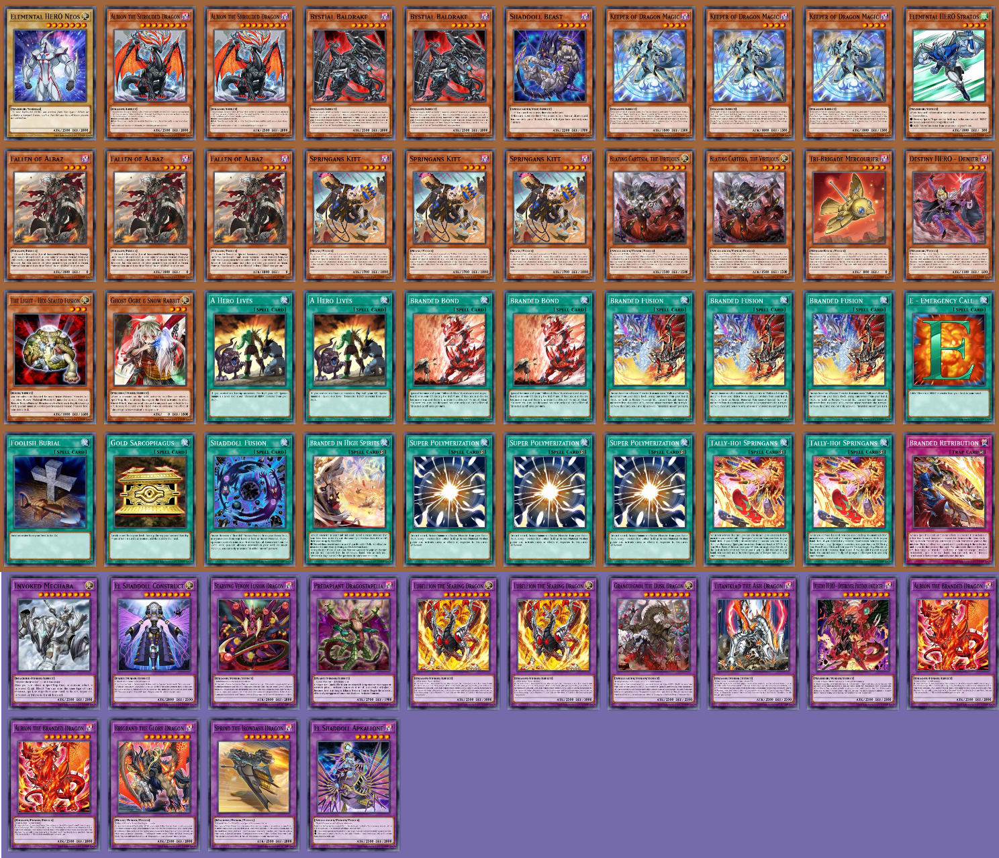

# CardSuggestions
A recommendation system for Yu-Gi-Oh! cards.

Multiple machine learning methods have been implemented, but the best performing method uses collaborative filtering together with KNN in order to suggest the most relevant cards.

Card suggestions can be requested by importing suggestions.py in another python file and calling ``suggest_cards_knn(deck_list, number_of_cards)``, where deck_list is a list of card ids.
The function k_means(deck_list) uses the K-means algorithm to group similar cards together, for a better overview of the recommendations.

Example usage can be seen in example.py, simply use 

``python example.py`` in the terminal to run.

This script suggests 30 cards for an example Branded deck, and divides it into clusters.

Example output:

## Deck

## Suggestions

## Clustered Suggestions (clusters separated by the card Melffy Rabby)

